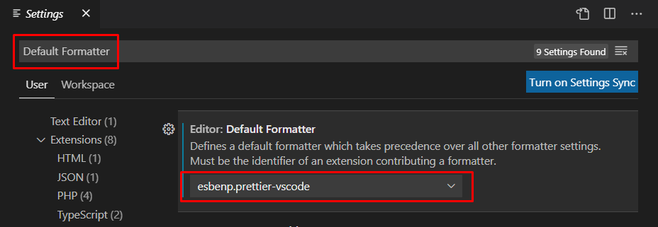
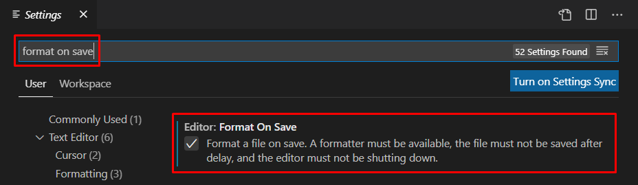

project/series/angular-i-ngrx-pishem-realnyj-proekt-s-nulya

# 1. Подготавливаем проект

Проверить установлен ли *nodejs* и *npm* и узнать их версии:
`node -v`
`npm -v`

Описание, как удалить старую версию *nodejs* и *npm*:
https://stackoverflow.com/questions/20711240/how-to-completely-remove-node-js-from-windows

Установка/обновление *angular*:
`npm install -g @angular/cli`

Узнать версию *angular*:
`ng --version`

Создание нового проекта с флагами, которые добавят роутинг, scss и уберут тесты https://angular.io/cli/new:
`ng new medium-app --routing=true --style=scss --skipTests=true`

Запуск проекта: 
`npm start` 

Так как нам нужен абсолютно чистый проект, то:
- удаляем весь существующий код из *app.component.html*
- удаляем существующую переменную *title* из *app.component.ts*

# 2. Почему нам нужен NgRx?

**Redux** — js-библиотека, предназначенная для управления состоянием приложения. 
Чаще всего используется в связке с *React* или *Angular* для разработки клиентской части. 
Содержит ряд инструментов, позволяющих значительно упростить передачу данных хранилища через контекст.

**NgRx** (https://ngrx.io/docs) - js-библиотека, реализует принцип работы *Redux* для *Angular*. 
Главная цель *NgRx* - централизовать и сделать максимально понятным управление всеми состояниями приложения.
Цель достигается благодаря заложенным в библиотеке принципам:
-	Наличие единственного источника данных о состоянии - хранилища (store);
-	Доступность состояния только для чтения;
-	Изменение состояние осуществляется только через действия (actions), которые обрабатываются редюсерами (reducer), представляющими собой чистые функции.

# 3. Планируем структуру проекта

Каждая отдельная страница - это отдельный модуль, который хранится в *src/app*.
Например, имеем 2 страницы *article* и *auth* - это значит, что создаем 2 директории *article* и *auth*:

```js
/src
	/app
		app.component.html
		app.component.scss
		app.component.ts
		app.module.ts

		/article
			article.module.ts

		/auth
			auth.module.ts
```

Внутри каждого модуля, создаем директорию *components*, в которой будут храниться компоненты в отдельных директориях.
Например, модуль *article* имеет директорию *components*, которая в свою очередь имеет вложенные директории, которые и являются компонентами:
- *article* - главный компонент модуля article, поэтому именуем так же как и модуль
- *comments*

```js
/src
	/app

		/article
			article.module.ts

			/components
				/article
					article.component.html
					article.component.scss
					article.component.ts
				/comments
					comments.component.html
					comments.component.scss
					comments.component.ts

		/auth
			auth.module.ts
```

Далее внутри каждого модуля необходимо создать:
- директорию *services* - для хранения сервисов, которые относятся к данному модулю. Главный сервис именуется как так же, как модуль
- директорию store - куда мы будем помещать все, что относится к NgRx
- директорию types - для хранения типов и интерфейсов модуля

```js
/src
	/app

		/article
			article.module.ts
			/components

			/services
				article.service.ts

			/store

			/types
				article.interface.ts
```

Теперь поговорим о вещах, которые мы хотим переиспользовать в разных местах (shareble). 
Сперва возьмем **компоненту**, которую мы хотим сделать shareble. 
Так просто поместить её в папку *shared* нельзя, поскольку компоненты не могут существовать сами по себе, они должны быть зарегистрированы в каком-то модуле. 
Поэтому shareble-компоненты должны быть модулями и мы помещаем их в директорию *shared --> modules*.
Например у нас есть shareble-модуль *feed*, который нужно использовать на двух страницах одновременно. Он имеет точно такую же структуру, как и любой другой модуль-страница:

```js
/src
	/app

		/article

		/shared
			/modules
				/feed
					/components
					/services
					/store
					/types
					feed.module.ts
```

**Сервисы** и **типы** не регистрируем ни на каком модуле. Мы просто кладем их в папку *shared*, а регистрируем их в том модуле, где хотим использовать.
Например, если мы используем сервис на двух страницах, то его нужно поместить в *shared --> services*:

```js
/src
	/app

		/article

		/shared
			/modules
				/feed

			/services
			
			/types
```

# 4. Расширение 'Prettier - Code formatter' - инструмент автоформатирования кода + Auto Import

https://prettier.io/

В редакторе VSCode переходим во вкладку расширения и устанавливаем **Prettier - Code formatter**.

**Если после установки Prettier не работает** идем 'File -> Preferences -> Settings' и выполняем следующее:   
   
    

    

Настройка Prettier: https://prettier.io/docs/en/options.html (доступные опции)

В корне проекта создаем файл **.prettierrc**, в который добавляем необходимые для форматирования кода опции:
```json
{
  "printWidth": 80,
  "tabWidth": 2,
  "semi": true, 
  "singleQuote": true,
  "bracketSpacing": true
}
```

В корне проекта создаем файл **.prettierignore**, в который добавляем файлы, которые не нужно форматировать

Для работы с TS также устанавливаем расширение **Auto Import** by steoates, которое облегчает импорт.

# 5. Language Server Protocol

*Language Server Protocol* (LSP) - протокол для общения между IDE и языковым сервером.
  
Идея заключается в том, что разные типы IDE общаются с одним и тем же сервером, и когда вы что-то ввели, то благодаря LSP вам доступны такие функции как автокомплит, переход к функции, показ ошибок, авто импорт и прочее. Т.е. когда IDE нужно показать автокомплит - происходит запрос к специальному серверу. В ответе возвращаются необходимые данные, которые IDE уже может отобразить. 
В VSCode для работы с typescript – LSP уже установлен.

# 6. Модуль регистрации

Наша задача создать страницу регистрации и авторизации.  
Вот как должны выглядеть эти страницы:
http://angular.realworld.io/register  
http://angular.realworld.io/login

В качестве бекэнда мы будем использовать публичный API:   
https://conduit.productionready.io/api/articles/

#### Базовая структура модуля:
Так как эти страницы имеют много общего, для них мы создадим один модуль auth внутри src/app --> auth:

```js
/src
	/app
		/auth
			auth.module.ts
```
Переходим в auth.module.ts и создаем там базовую структуру, которая должна существовать в каждом новом модуле:

```js
import { NgModule } from '@angular/core';
import { CommonModule } from '@angular/common';

@NgModule({
  imports: [CommonModule],
})
export class AuthModule {}
```

#### Базовая структура компонента:
Внутри auth создаем директорию components, внутри которой, для нашей страницы регистрации создаем директорию src/app/auth/components/register, где будет храниться register.component:

```js
/src
	/app
		/auth
			auth.module.ts
			/components
				/register
					register.component.html
					register.component.scss
					register.component.ts
```
Переходим в register.component.ts и создаем там базовую структуру, которая должна существовать в каждом новом компоненте:

```js
import { Component } from '@angular/core';

@Component({
  selector: 'ma-register',
  templateUrl: './register.component.html',
  styleUrls: ['./register.component.scss'],
})
export class RegisterComponent {}
```
Здесь стоит отметить, что строка `selector: 'ma-register'` содержит имя селектора с префиксом `ma`, что является сокращением от названия нашего приложения `medium-app`. Это правило создано для того, чтобы в коде различать сторонние библиотеки от наших собственных компонент.
Например, в коде ниже мы видим, что внутри нашего компонента *ma-register* вложен сторонний компонент библиотеки *Angular material*:

```html
<ma-register>
  <mat-slider value="1"></mat-slider>
<ma-register>
```

#### Регистрация компонента внутри модуля:
Чтобы начать пользоваться только что созданным компонентом register, его нужно зарегистрировать в модуле auth, которому он принадлежит.
Переходим в auth.module.ts и выполняем следующее:
- импортим register.component
- регистрируем register.component в поле declarations

```js
import { RegisterComponent } from './components/register/register.component';
@NgModule({
  declarations: [RegisterComponent],
})
```

#### Регистрация модуля внутри главного app модуля:
Далее нужно зарегистрировать созданный нами auth.module.ts внутри app.module.ts. Для этого:
- импортим auth.module
- добавляем auth.module в массив imports

```js
import { AuthModule } from './auth/auth.module';
@NgModule({
  imports: [AuthModule],
})
export class AppModule {}
```

#### Регистрация роута
Далее нужно описать роут, на котором будет рендериться register.component. Есть 2 способа.

**Первый способ - регистрация роута компонента register внутри app-routing.module.ts**
- импортим register.component
- в существующий массив routes добавляем объект с описанием path и component
- добавляем router-outlet в app.component.html

```js
import { RegisterComponent } from './auth/components/register/register.component';
const routes: Routes = [
  {
    path: 'register',
    component: RegisterComponent,
  },
];
```
У данного способа есть минус - если в будущем мы решим удалить модуль auth, который хранит компонент register, то нам прийдется делать очистку снаружи его, то-есть в файле app-routing.module.ts. Чтобы этого избежать, лучше использовать второй способ. 

**Второй способ - регистрация роута компонента register внутри его родителя - модуля auth.module.ts**
- импортим Routes, RouterModule
- импортим register.component
- создаем массив routes в который добавляем объект с описанием path и component
- импортим созданный роут с помощью RouterModule.forChild() внутрь передавая массив routes
- добавляем router-outlet в app.component.html

```js
import { Routes, RouterModule } from '@angular/router';
import { RegisterComponent } from './components/register/register.component';
const routes: Routes = [
  {
    path: 'register',
    component: RegisterComponent,
  },
];
@NgModule({
  imports: [RouterModule.forChild(routes)],
})
```

**router-outlet**    
Два вышеописанных способа должны работать в связке с router-outlet, который позволяет рендерить страницы.
Для этого в app.component.html помещаем следующее:

```html
<router-outlet></router-outlet>
```
